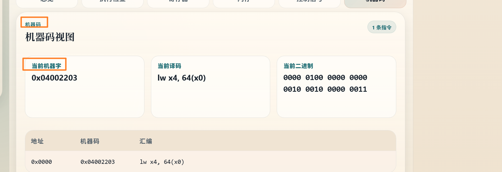

- [x] 变颜色高亮
- [x] 加法器和alu分开  自增加法器  pc转移加法器  ALU
- [x] 信号尽量放到方框里面  控制信号可以放外面
- [x] 寄存器的值   可以自己置入
- [x] 改成32位地址  截取前四位
- [x] 机器码  二进制对齐
- [x] 当前机器字  当前译码  变大一些字 
- [x] alusrca信号  pcsource改为pcs，iord信号没有，imm32应该合并到ID1
- [x] ALUop后面括号加上01代码
- [x] 执行时间线  指令字体大一些
- [ ] 名称HDU-CPU-RV

- [x] 有些信号放到框里
- [x] imm32 组件移除
- [x] 自增加法器 4 框移除
- [x] 信号线放竖线上
- [x] 在信号真正有效时候才高亮

- pc_s在pcwrite=1时才有效

- w_data_s在regwrite=1时才有效

- [x] 内存窗口+0 +F

- [x] passB不需要 lui指令不需要经过ALU  只要两个周期

- [x] 当前二进制放到当前机器字框内，放指令类型、对应类型的指令格式(编码)

| I[31:20]     | I[19:15] | I[14:12] | I[11:7] | I[6:0] |
| ------------ | -------- | -------- | ------- | ------ |
| imm12        | rs1      | funct3   | rd      | opcode |
| 000000000101 | 00000    | 000      | 00010   | 010011 |

J型指令

| I[31:12]              | I[11:7] | I[6:0] |
| --------------------- | ------- | ------ |
| imm[20,10:1,11,19:12] | rd      | opcode |

B型指令

| I[31:25]     | I[24:20] | I[19:15] | I[14:12] | I[11:7]     | I[6:0] |
| ------------ | -------- | -------- | -------- | ----------- | ------ |
| imm[12,10:5] | rs2      | rs1      | funct3   | imm[4:1,11] | opcode |

